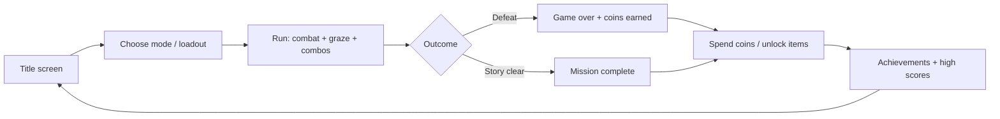

# Sky Blaster — Project Whitepaper

|                      |                                                     |
| -------------------- | --------------------------------------------------- |
| **Project**          | Sky Blaster (polished-arcade-shooter)               |
| **Game version**     | v0.9.0                                              |
| **Document version** | 1.3.0                                               |
| **Last updated**     | 2026-07-11 17:18 (UTC+8)                            |
| **Status**           | Expansion complete (Phases 1–6)                     |
| **License**          | MIT                                                 |
| **Live demo**        | https://phaethix.github.io/polished-arcade-shooter/ |
| **Repository**       | https://github.com/phaethix/polished-arcade-shooter |

> **Living document.** This whitepaper is updated alongside major product or architecture changes. See [Appendix D — Document revision history](#appendix-d--document-revision-history) for the full changelog.

---

## Abstract

Sky Blaster is a browser-native vertical shoot-em-up built to demonstrate how a minimal arcade prototype can evolve into a full-featured game without abandoning its core loop. Starting from a single endless mode on a Canvas surface, the project grew through six deliberate expansion phases — aircraft loadouts, weapons, enemy ecology, environmental chapters, alternate game modes, and persistent meta progression — each shipped as a playable vertical slice.

The result is a self-contained, zero-install game that runs at 60 fps on desktop and mobile, synthesizes its own audio, persists player progress locally, and deploys automatically to GitHub Pages. This document describes the product vision, system design, development methodology, and release trajectory that produced the current v0.7.0 build.

---

## 1. Introduction

### 1.1 Background

Classic vertical shooters — _Raiden_, _1942_, _Touhou_ — share a deceptively simple formula: move, shoot, dodge, survive. Modern web platforms make it possible to deliver that experience instantly, but many browser games stop at a proof-of-concept: one ship, one enemy type, no persistence, no reason to return.

Sky Blaster was conceived as an exercise in **polish and incremental depth**: prove that a small TypeScript codebase can absorb substantial feature growth while remaining maintainable, testable, and fun at every intermediate release.

### 1.2 Vision

> A fast-paced arcade shooter that feels juicy from the first second, rewards skill across multiple play styles, and gives players long-term goals — all in the browser, with no backend and no asset downloads.

The north-star qualities are **responsiveness** (input latency, frame pacing), **feedback** (particles, screen shake, audio, score popups), and **replayability** (modes, unlocks, daily challenges).

### 1.3 Scope of this document

This whitepaper is a **project-level** artifact. It explains what Sky Blaster is, why it was built this way, and how its major systems fit together. It is not a player manual; for install instructions and quick controls, see [README.md](../README.md). For git workflow, see [GIT_CONVENTIONS.md](./GIT_CONVENTIONS.md).

---

## 2. Design philosophy

Three principles governed every expansion phase:

**Incremental vertical slices.** Each phase delivered a complete, playable layer — not a half-wired feature waiting for a future PR. Players could always launch the game and enjoy a coherent experience.

**Extend, never replace.** Endless mode, the original core loop, remained intact throughout development. Story, boss rush, daily challenge, and practice are overlays on shared engine primitives, not parallel codebases.

**One concern per commit.** Types, data definitions, game logic, UI, and documentation landed in separate commits. This kept reviews small, bisects clean, and history readable — enforced in CI via Conventional Commits.

These constraints produced a modular `src/game/` layout where each file owns a single domain (enemies, weapons, chapters, modes, progress) and `engine.ts` orchestrates the loop. Rendering, input, and shared constants were later extracted into `render/`, `app/`, and `core/` without changing gameplay behavior.

---

## 3. Product overview

### 3.1 Core experience

Sky Blaster is a **400×700** logical-resolution canvas game embedded in a React shell. The player pilots a starfighter upward through hostile space, destroying waves of enemies, collecting power-ups, and pursuing high scores. Combat emphasizes:

- **Graze scoring** — near-misses on enemy bullets award points and feed achievements.
- **Combo chains** — rapid kills within a 1.5 s window multiply score.
- **Boss spectacle** — boss defeats trigger slow-motion, screen flash, and shockwave particles.

All sound is **procedurally synthesized** via the Web Audio API; no external audio files are loaded.

### 3.2 Play modes

Five modes share the same combat engine but differ in structure and goals:

| Mode                | Purpose                                                                                                                               |
| ------------------- | ------------------------------------------------------------------------------------------------------------------------------------- |
| **Story**           | A 20-stage campaign (4 chapters × 5 stages) with narrative boss encounters and a mission-complete ending.                             |
| **Endless**         | The original survival loop — infinite waves, escalating difficulty, chapter rotation every 5 waves.                                   |
| **Boss Rush**       | Skill check — consecutive boss fights with scaling HP and no filler waves.                                                            |
| **Daily Challenge** | Retention hook — a date-seeded modifier (double speed, no power-ups, single HP, or kamikaze swarm); gameplay RNG is also date-seeded. |
| **Practice**        | Invincible sandbox (toggle with `I`) for loadout and pattern training; menu start-wave select (1–20); no coins, achievements, or high scores. |

### 3.3 Loadout depth

**Three aircraft** trade speed, durability, and active skills:

- _Falcon_ — balanced; missile salvo.
- _Phantom_ — fast and fragile; dash with invincibility frames.
- _Fortress_ — slow and tanky; energy shield that absorbs hits and empowers attacks.

**Five weapons** alter the firing model: standard spread, armor-piercing pierce, shotgun burst, sustained laser ramp, and homing missiles. Weapons are selectable on the menu and discoverable as in-run drops.

**Difficulty tiers** (Easy / Normal / Hard) scale enemy speed, HP, spawn rate, and starting HP. Keyboard auto-fire defaults on and toggles with `F`.

### 3.4 Enemy ecology

Ten enemy archetypes create escalating tactical pressure:

- **Foundation** — basic, fast, tank, boss.
- **Behavioral** — splitter (spawns minis), sniper (aimed shots), shielded (directional armor), kamikaze (rush explosion), healer (aura support).

Spawn pools widen as waves advance; boss waves replace the full wave with a single high-HP target. Each chapter’s boss uses a distinct attack pattern and hull accent (fan, rain, broadside, ring).

### 3.5 Environmental chapters

Four chapters rotate visual identity and introduce **environmental hazards** independent of enemy spawns:

1. **Deep Space** — baseline starfield, no hazards.
2. **Asteroid Belt** — falling debris the player must dodge.
3. **Enemy Carrier** — fixed turrets that fire independently of enemy waves.
4. **Wormhole** — teleport pads that relocate the player on contact.

Chapters bind together aesthetics (gradient, nebula palette, HUD accent) and mechanics (hazard type), giving each fifth of a run a distinct feel.

### 3.6 Meta progression

Long-term engagement is handled entirely on the client:

- **Coins** — earned from kills, boss defeats, story stage clears, and daily milestones; spent to permanently unlock aircraft and weapons.
- **Achievements** — six lifetime or per-run goals (first kill, 20× combo, 50 grazes, 10 boss kills, wave 10, no-damage stage clear) with on-screen unlock toasts.
- **High scores** — top-10 local leaderboard with wave and date.

No account system, no server, no analytics SDK — progression lives in `localStorage`.

---

## 4. Player journey

The intended session arc moves players from discovery to mastery to collection:



New players start with the Falcon and Standard Blaster, learn endless mode, and naturally encounter locked loadout options. Coins and achievements create reasons to replay alternate modes — especially daily challenge and boss rush — without mandatory grinding.

---

## 5. Technical architecture

### 5.1 Stack

| Layer       | Choice                      | Rationale                                                        |
| ----------- | --------------------------- | ---------------------------------------------------------------- |
| UI shell    | React 19                    | Minimal wrapper; game state lives outside the React tree in refs |
| Language    | TypeScript 5.9              | Shared types across all game modules                             |
| Build       | Vite 7 + single-file plugin | One HTML artifact for GitHub Pages                               |
| Rendering   | Canvas 2D API               | Full control over draw order, particles, and blend modes         |
| Audio       | Web Audio API               | Zero asset weight; instant load                                  |
| Styling     | Tailwind CSS 4              | Full-screen layout only; gameplay is canvas-drawn                |
| Persistence | `localStorage`              | No backend; offline-capable progression                          |

### 5.2 Runtime model

`App.tsx` owns a single `requestAnimationFrame` loop capped at ~60 fps. Each tick:

1. **Update** — if `playing`, advance simulation (movement, waves, collisions, particles).
2. **Render** — scale the 400×700 logical canvas to the viewport, draw background → hazards → entities → HUD → overlays.

Input is collected through keyboard events and unified touch/mouse drag, stored in a mutable ref to avoid React re-renders during gameplay.

### 5.3 Module architecture

`src/` is organized in three layers: a React shell (`App.tsx`, `app/input.ts`), a game orchestrator (`engine.ts`), and flat domain modules (aircraft, weapons, enemies, chapters, hazards, modes, progress, audio). Shared infrastructure sits under `game/core/`, `game/render/`, `game/storage/`, and `game/effects.ts`.

**Dependency direction** flows inward: `engine.ts` imports domain and render modules; domain modules do not import `engine.ts`. Data definitions (`aircraft.ts`, `weapons.ts`, `chapters.ts`) are pure config + helpers.

For the full module tree, dependency rules, and future split points, see [ARCHITECTURE.md](./ARCHITECTURE.md).

### 5.4 State machine

```text
menu ──start──▶ playing ◀──resume── paused
                  │
                  ├──▶ gameover (defeat or story victory)
                  │
                  └──▶ (story) mission complete → gameover + modeVictory flag
```

`GameData` is a single mutable struct passed through update and render. Mode-specific behavior is resolved at runtime via `gameMode` and helper functions in `modes.ts`, avoiding subclass hierarchies.

### 5.5 Persistence schema

| Storage key                   | Data                             |
| ----------------------------- | -------------------------------- |
| `sky_blaster_hs_v2`           | High scores (top 10)             |
| `sky_blaster_coins_v1`        | Coin balance                     |
| `sky_blaster_unlocks_v1`      | Unlocked aircraft and weapon IDs |
| `sky_blaster_achievements_v1` | Unlocked achievement IDs         |
| `sky_blaster_stats_v1`        | Lifetime kill counters           |

Version suffixes in keys allow future migrations without corrupting existing saves.

---

## 6. Development methodology

### 6.1 Phased expansion

The project followed a published roadmap (`.issue/2026-07-07-roadmap.md`) of six phases:

| Phase | Theme                   | Outcome                                 |
| ----- | ----------------------- | --------------------------------------- |
| 1     | Aircraft foundation     | Three playable ships with unique skills |
| 2     | Weapons                 | Five weapons, menu + in-run switching   |
| 3     | New enemies             | Five advanced enemy behaviors           |
| 4     | Chapters & environments | Four visual chapters with hazards       |
| 5     | Game modes              | Story, endless, boss rush, daily        |
| 6     | Meta progression        | Coins, unlocks, achievements            |

Each phase was specified in `.issue/YYYY-MM-DD-*.md`, implemented across multiple small commits, reviewed via pull request, tagged on merge, and deployed automatically.

### 6.2 Release cadence

| Tag    | Milestone                           |
| ------ | ----------------------------------- |
| v0.2.0 | Aircraft + skills                   |
| v0.3.0 | Weapons + enemy expansion (partial) |
| v0.4.0 | Advanced enemy types                |
| v0.5.0 | Chapter environments                |
| v0.6.0 | Game modes                          |
| v0.7.0 | Meta progression                    |
| v0.8.0 | Chapter boss patterns + docs sync   |
| v0.9.0 | Practice start-wave + gamepad       |

Tags trigger the `release.yml` workflow, which builds the production bundle and publishes a GitHub Release. Pushes to `main` trigger CI (typecheck + build) and GitHub Pages deployment.

### 6.3 Quality gates

- **TypeScript** — `npm run typecheck` on every CI run.
- **Lint / format / tests** — ESLint, Prettier (`format:check`), and Vitest (`test:run`) run in CI.
- **Commit lint** — Husky + Commitlint enforce Conventional Commits locally; `git-conventions.yml` validates on PR.
- **Single-file build** — production output is one HTML file, eliminating path issues on GitHub Pages.

---

## 7. Content economy

### 7.1 Coin sources and sinks

Coins are the sole currency. Sources reward active play (kills, bosses, stage clears, daily milestones); sinks are permanent unlocks for aircraft and alternate weapons. Starting loadout is always free, so the game never hard-locks new players.

This creates a gentle power curve: skill earns currency, currency expands tactical options, expanded options enable higher scores and achievement hunting.

### 7.2 Achievement design

Achievements span three time horizons:

- **Instant** — first kill.
- **Single-run** — combo, graze, no-damage stage.
- **Lifetime** — boss slayer, survivor.

Toast notifications celebrate unlocks without interrupting gameplay, reinforcing mastery moments.

---

## 8. Future direction

Phases 1–6 are complete. Post-expansion work already shipped includes difficulty tiers, Practice mode (with start-wave select 1–20), run statistics on game over, Daily seeded gameplay RNG, auto-fire toggle, chapter-specific boss attack patterns, and standard gamepad gameplay controls.

Optional backlog items (see `.issue/2026-07-07-roadmap.md`):

- **Accessibility** — colorblind-friendly palettes for enemies and pickups.

---

## 9. Conclusion

Sky Blaster demonstrates that a focused arcade game can grow from a weekend prototype into a multi-mode, progression-driven experience while keeping the codebase small, typed, and deployable as static HTML. The phased roadmap, modular architecture, and strict commit discipline made it possible to ship nine tagged minor releases without a rewrite.

The project is **feature-complete** against its original expansion plan. It is playable at https://phaethix.github.io/polished-arcade-shooter/, open source under MIT, and open to community contribution under the guidelines in [CONTRIBUTING.md](../CONTRIBUTING.md).

---

## Appendix A — Story campaign structure

| Stages | Chapter       | Boss            |
| ------ | ------------- | --------------- |
| 1–5    | Deep Space    | Space Commander |
| 6–10   | Asteroid Belt | Mining Rig      |
| 11–15  | Enemy Carrier | Carrier Core    |
| 16–20  | Wormhole      | Void Entity     |

## Appendix B — Unlock costs

| Item           | Cost (coins) |
| -------------- | ------------ |
| Phantom        | 500          |
| Fortress       | 800          |
| Armor Piercing | 300          |
| Shotgun        | 400          |
| Laser          | 600          |
| Homing         | 600          |

## Appendix C — Related documents

| Document                                                        | Role                                  |
| --------------------------------------------------------------- | ------------------------------------- |
| [README.md](../README.md)                                       | Repository overview and quick start   |
| [PLAYER_GUIDE.md](./PLAYER_GUIDE.md)                            | Controls, modes, enemies, progression |
| [ARCHITECTURE.md](./ARCHITECTURE.md)                            | Source layout and dependency rules    |
| [GIT_CONVENTIONS.md](./GIT_CONVENTIONS.md)                      | Contributor git workflow              |
| [CONTRIBUTING.md](../CONTRIBUTING.md)                           | Development and pull request workflow |
| [.issue/2026-07-07-roadmap.md](../.issue/2026-07-07-roadmap.md) | Phase checklist and backlog           |
| [.issue/001–006](../.issue/)                                    | Per-feature specification notes       |

## Appendix D — Document revision history

This appendix records **edits to the whitepaper itself**, not game release notes. For shipped game versions, see [Section 6.2](#62-release-cadence) and [GitHub Releases](https://github.com/phaethix/polished-arcade-shooter/releases).

### How to update this document

When you change product scope, architecture, or methodology described here:

1. Edit the relevant sections in `docs/WHITEPAPER.md`.
2. Bump **Document version** in the header (semver: major = restructure or scope shift; minor = new sections or substantive edits; patch = typos and clarifications).
3. Set **Last updated** to the edit timestamp (`YYYY-MM-DD HH:MM (UTC+8)`).
4. Add a row to the table below (newest first).
5. If **Game version** in the header changed, update it too.
6. Include the whitepaper change in the same PR as the product change when possible.

### Changelog

| Doc version | Updated at (UTC+8) | Game version | Changes                                                                                                                                                                                                                                                 |
| ----------- | ------------------ | ------------ | ------------------------------------------------------------------------------------------------------------------------------------------------------------------------------------------------------------------------------------------------------- |
| **1.3.0**   | 2026-07-11 17:18   | v0.9.0       | Synced to v0.9.0: Practice start-wave, gamepad gameplay; §3.2 / §6.2 / §8 updated; colorblind remains optional backlog.                                                                                                                                 |
| **1.2.2**   | 2026-07-07 22:10   | v0.7.0       | §5.3 condensed to a layer summary; full module tree deferred to [ARCHITECTURE.md](./ARCHITECTURE.md).                                                                                                                                                   |
| **1.2.1**   | 2026-07-07 22:09   | v0.7.0       | §5.3 module tree expanded to list all `render/` files; aligned with [ARCHITECTURE.md](./ARCHITECTURE.md) and current `src/` layout.                                                                                                                     |
| **1.2.0**   | 2026-07-07 22:05   | v0.7.0       | §5.3 updated for `core/`, `render/`, `app/`, and `storage/` split; added [ARCHITECTURE.md](./ARCHITECTURE.md) to Appendix C.                                                                                                                            |
| **1.1.1**   | 2026-07-07 21:57   | v0.7.0       | **Last updated** now records time to the minute; changelog **Updated at** column uses the same format.                                                                                                                                                  |
| **1.1.0**   | 2026-07-07 21:56   | v0.7.0       | Added living-document notice, header metadata (`Document version`, `Last updated`), and this revision history appendix with maintainer guidelines.                                                                                                      |
| **1.0.0**   | 2026-07-07 21:54   | v0.7.0       | Initial project whitepaper: abstract, design philosophy, product overview, player journey, technical architecture, development methodology, content economy, future direction, and appendices. Replaced the earlier `GAME_OVERVIEW.md` reference draft. |
| **0.1.0**   | 2026-07-07 21:50   | v0.7.0       | Draft `docs/GAME_OVERVIEW.md` — v0.7.0 feature reference (tables for modes, controls, enemies, persistence). Superseded by v1.0.0 whitepaper.                                                                                                           |
